# M・S CFD App - アプリケーション全体ワークフロー

## 概要

BTC Mock Appは、ビットコインポートフォリオ管理をシミュレーションするWebアプリケーションです。管理者主導のアカウント管理と、段階的な権限制御により、安全で統制の取れた仮想取引環境を提供します。

## システム全体アーキテクチャフロー

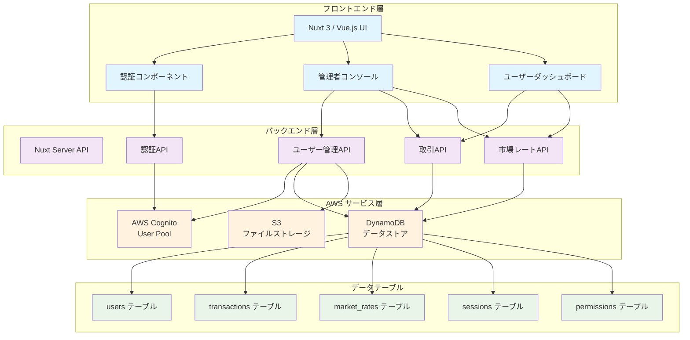

## 主要ユーザージャーニー

### 1. 管理者ジャーニー

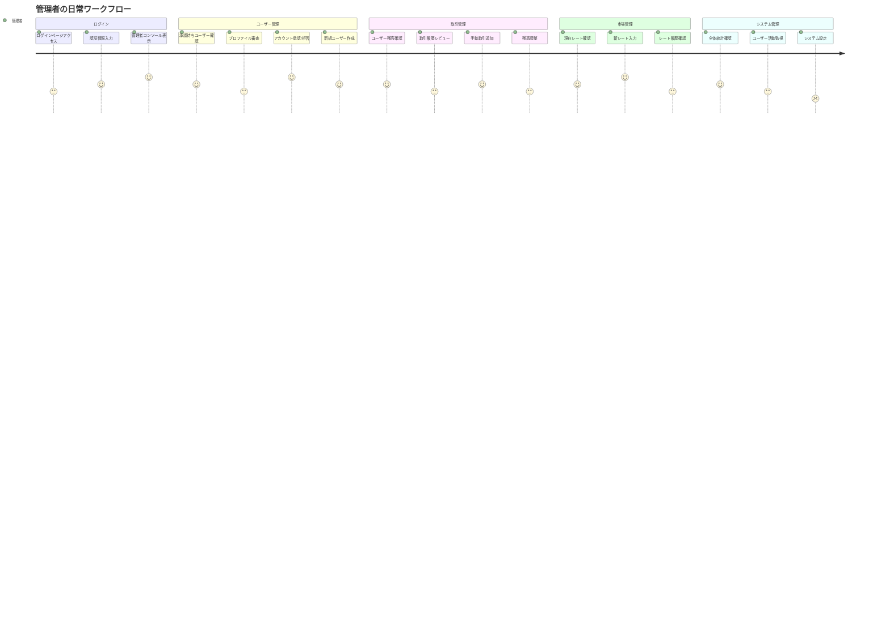

### 2. 一般ユーザージャーニー

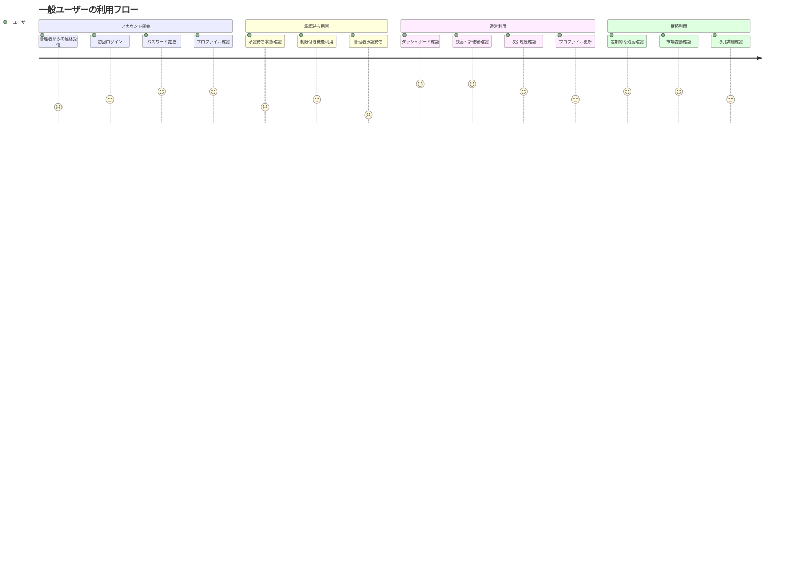

## 主要ビジネスプロセスフロー

### 1. アカウントライフサイクル

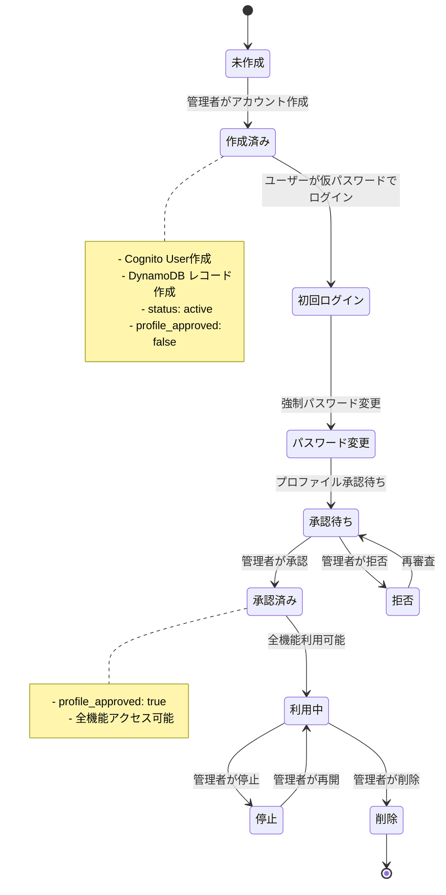

### 2. 取引処理フロー

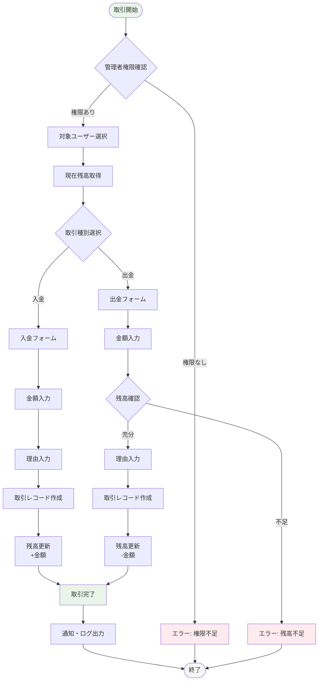

### 3. 市場レート更新フロー

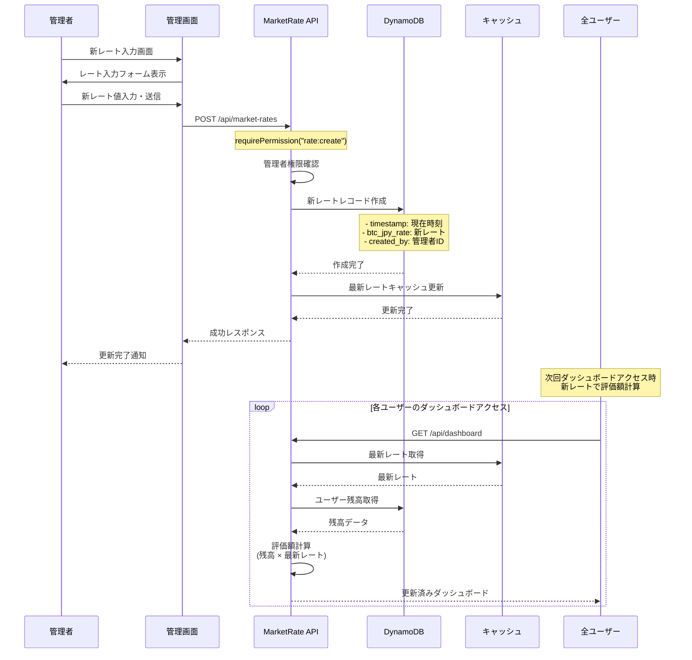

## データフローアーキテクチャ

### 1. 認証データフロー

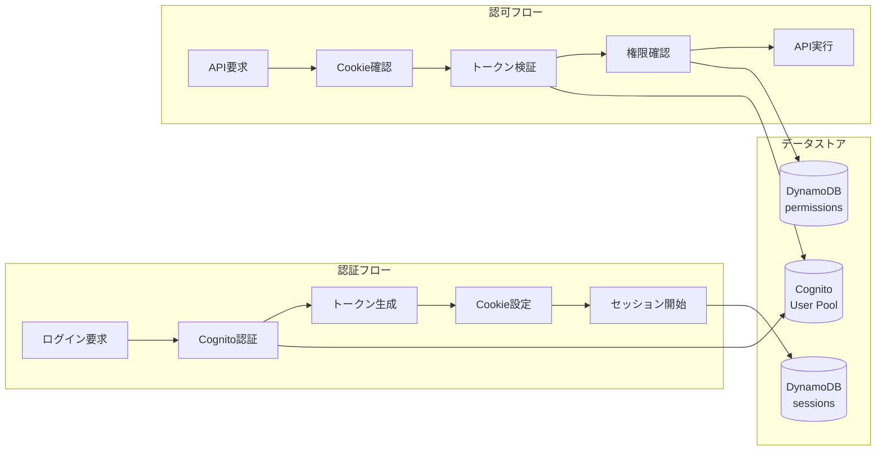

### 2. ユーザーデータフロー

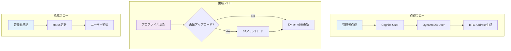

### 3. 取引データフロー

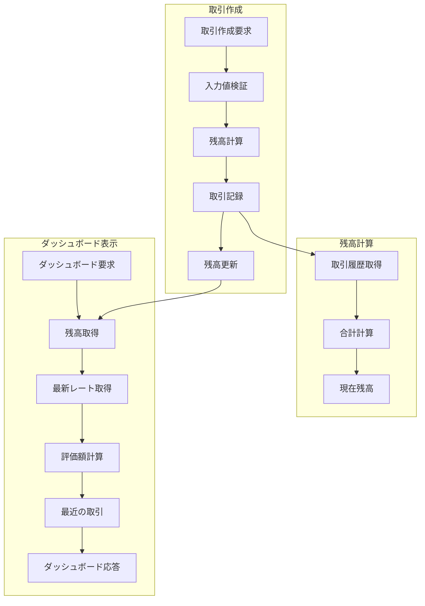

## エラーハンドリングとリカバリー

### 1. システムエラーフロー

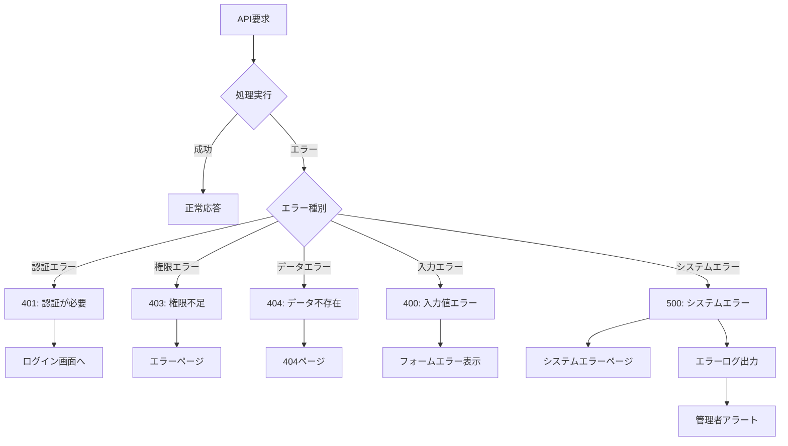

### 2. データ整合性チェック

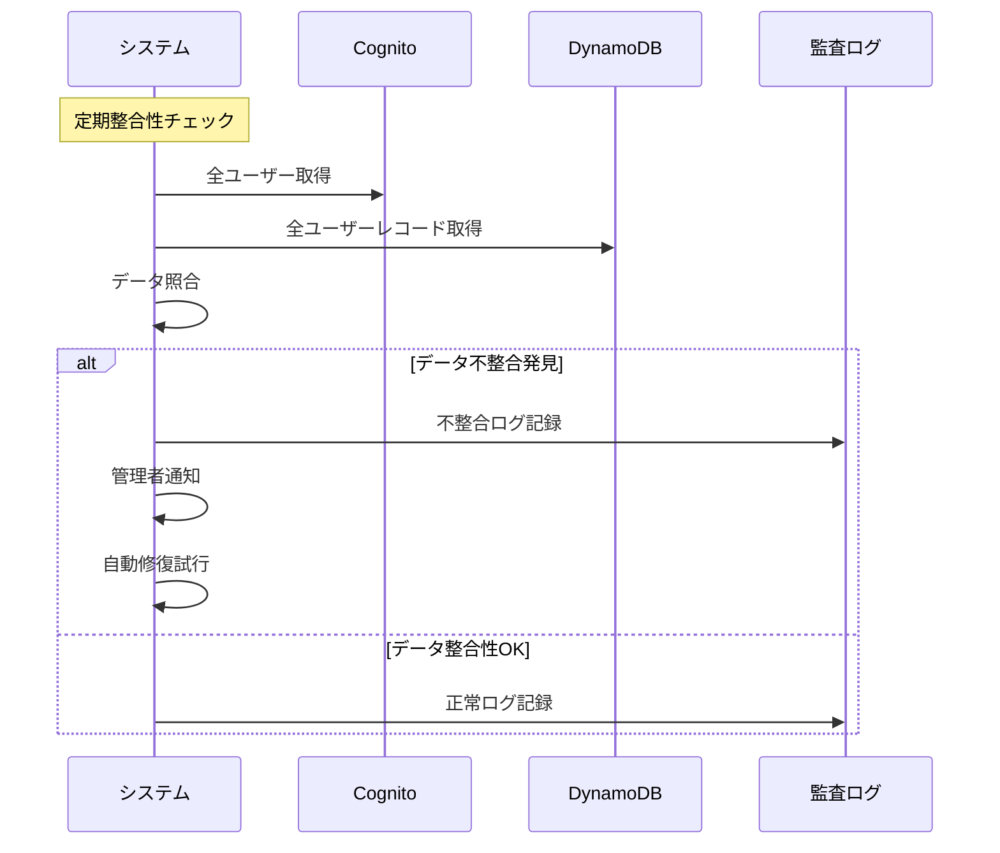

## パフォーマンス最適化ポイント

### 1. データアクセス最適化

| 操作 | 最適化手法 | 実装 |
|------|-----------|------|
| ユーザー一覧取得 | ページネーション | `LastEvaluatedKey`使用 |
| 取引履歴取得 | インデックス活用 | GSI `user_id-timestamp` |
| 残高計算 | キャッシュ化 | 計算結果の一時保存 |
| 市場レート | キャッシュ化 | 最新値のメモリキャッシュ |

### 2. フロントエンド最適化

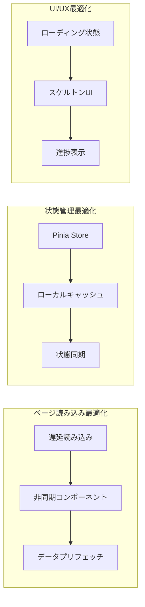

## 監視・メトリクス

### 1. 主要メトリクス

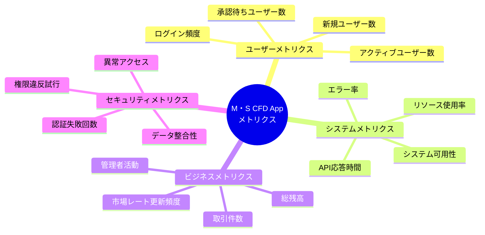

### 2. アラート設定

| メトリクス | 閾値 | アクション |
|-----------|------|-----------|
| API応答時間 | > 5秒 | 管理者通知 |
| エラー率 | > 5% | 緊急アラート |
| ログイン失敗 | > 10回/時間 | セキュリティアラート |
| データ不整合 | > 0件 | 即座に管理者通知 |

---

このワークフローは、BTC Mock Appの全体的な動作を包括的に示しています。各機能の詳細フローは、個別のワークフロー図で補完されます。