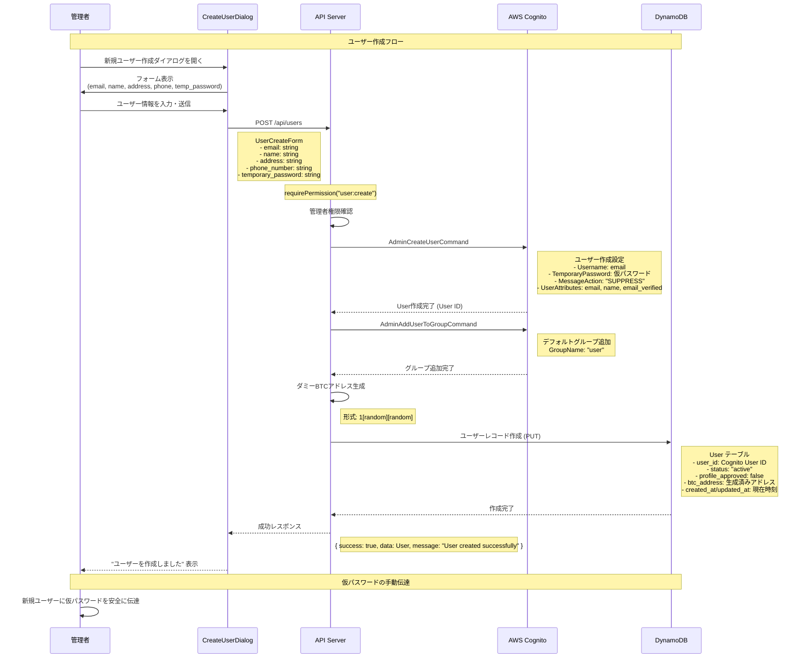
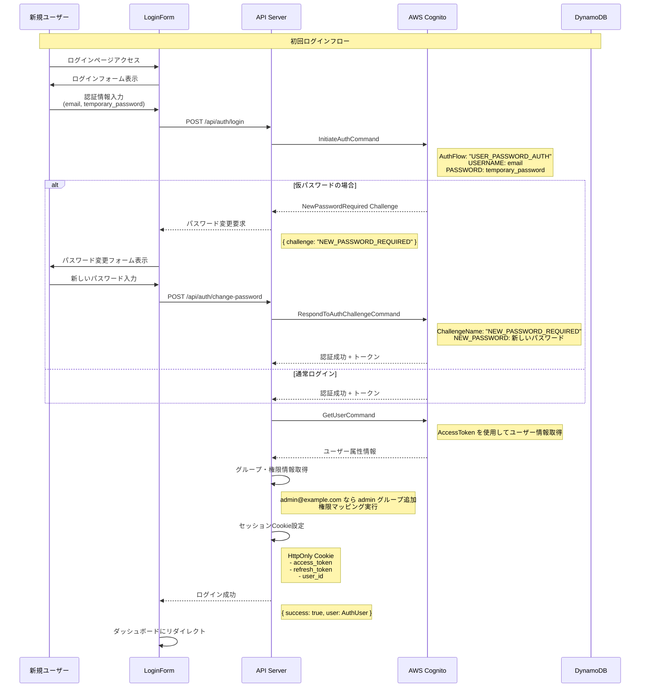
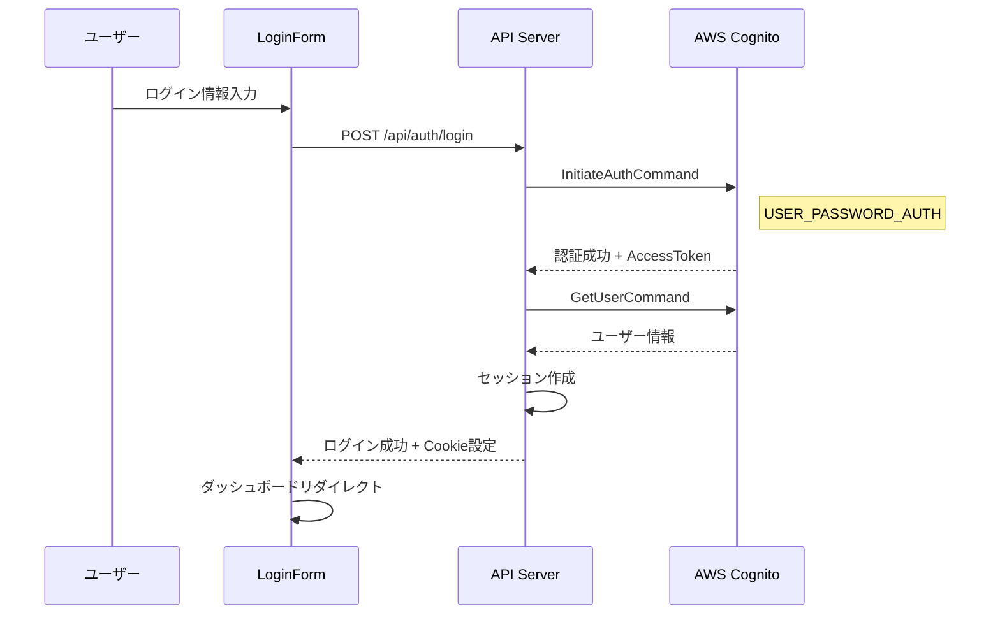
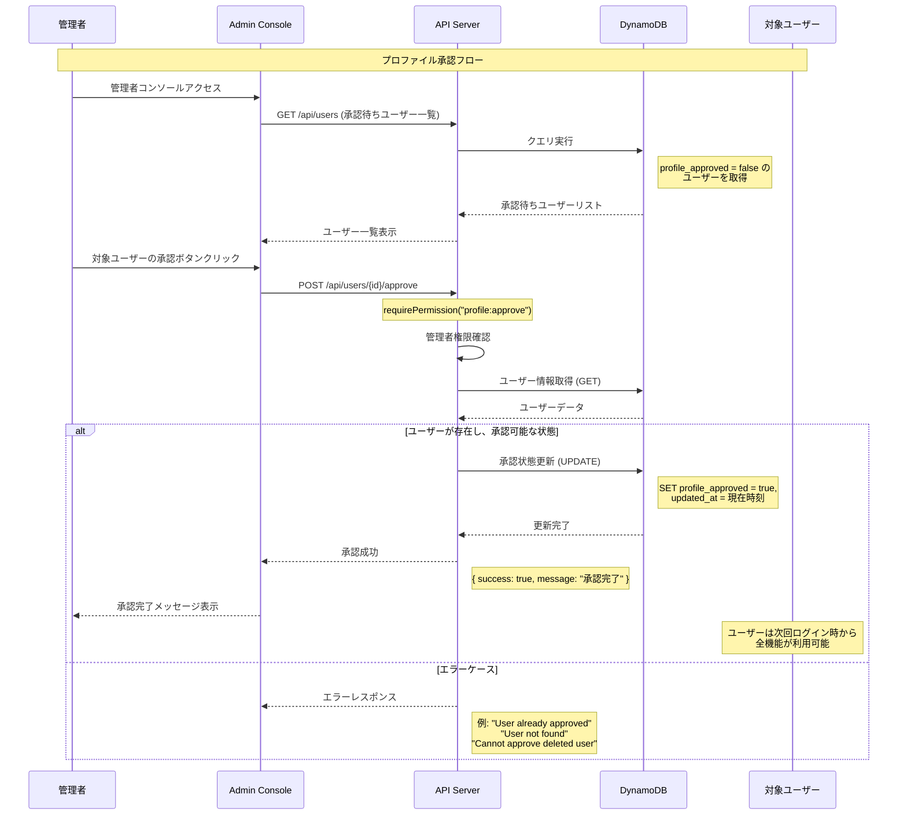
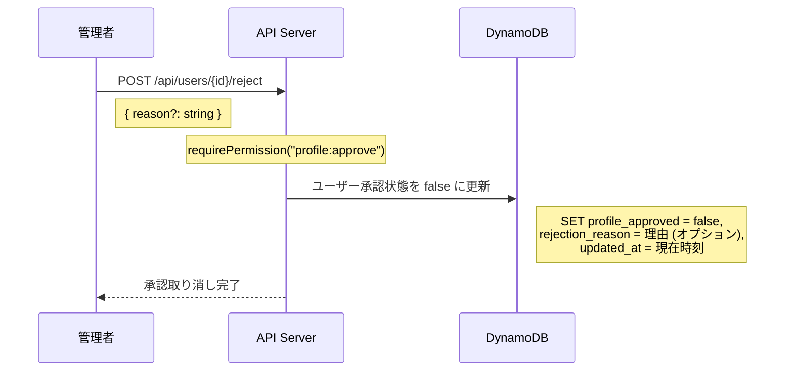
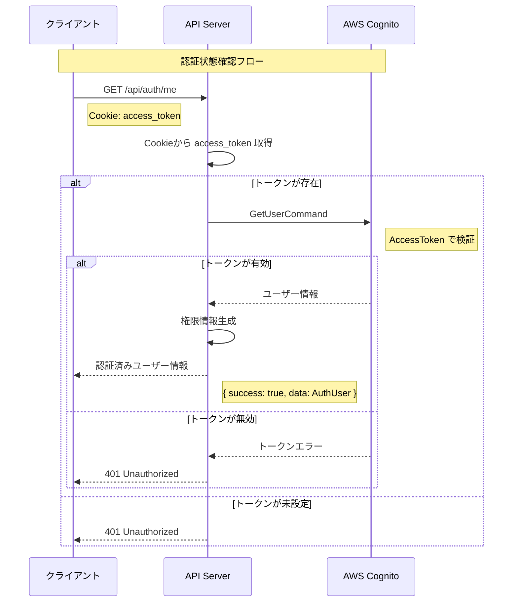
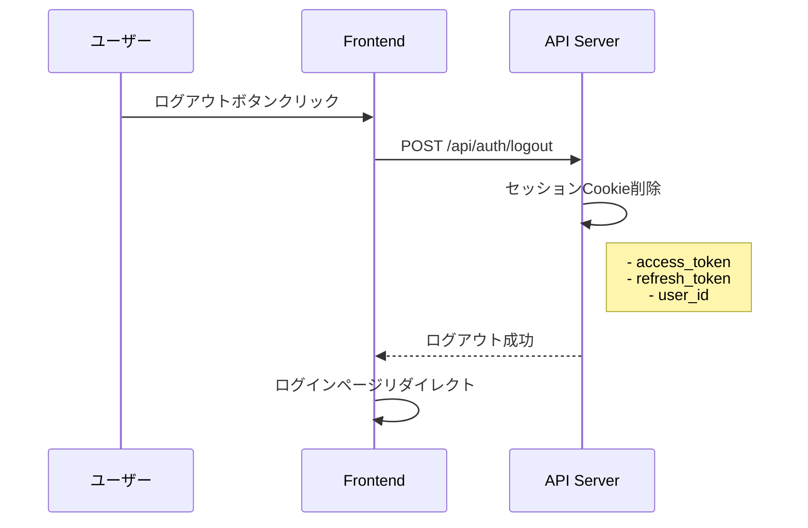

# 認証システム シーケンス図

## 概要

BTC Mock Appの認証システムは、AWS Cognitoを基盤とした管理者主導のアカウント管理システムです。ユーザー自身による登録機能はなく、管理者がアカウントを作成し、段階的な承認プロセスを経て利用開始となります。

## 1. アカウント作成シーケンス

### 1.1 管理者によるユーザー作成



### 1.2 データ構造

#### リクエスト（UserCreateForm）
```typescript
{
  email: string           // メールアドレス（Cognitoのusername）
  name: string           // 氏名
  address: string        // 住所
  phone_number: string   // 電話番号
  temporary_password: string  // 仮パスワード（8文字以上、小文字・数字必須）
}
```

#### 作成されるデータ
```typescript
// Cognito User Pool
{
  Username: email,
  TemporaryPassword: temporary_password,
  UserAttributes: [
    { Name: 'email', Value: email },
    { Name: 'name', Value: name },
    { Name: 'email_verified', Value: 'true' }
  ],
  Groups: ['user']
}

// DynamoDB users テーブル
{
  user_id: string,          // Cognito User ID
  email: string,
  name: string,
  address: string,
  phone_number: string,
  status: 'active',
  profile_approved: false,  // 承認待ち状態
  btc_address: string,      // 自動生成
  created_at: string,
  updated_at: string
}
```

## 2. ログイン・認証シーケンス

### 2.1 初回ログイン（パスワード変更必須）



### 2.2 通常ログイン



## 3. プロファイル承認シーケンス

### 3.1 承認プロセス



### 3.2 承認取り消し



## 4. セッション管理

### 4.1 認証状態確認



### 4.2 ログアウト



## 5. エラーハンドリング

### 5.1 認証エラーパターン

| エラーケース | HTTPステータス | メッセージ | 対応 |
|-------------|---------------|-----------|------|
| 無効な認証情報 | 401 | Invalid credentials | ログインフォームに戻る |
| 権限不足 | 403 | Insufficient permissions | エラーページ表示 |
| ユーザー不存在 | 404 | User not found | 管理者に連絡 |
| 既に承認済み | 400 | User profile is already approved | 状態確認 |
| 削除済みユーザー | 400 | Cannot approve deleted user | 状態確認 |
| トークン期限切れ | 401 | Token expired | 再ログイン要求 |

### 5.2 Cognitoエラー処理

```typescript
// よくあるCognitoエラー
try {
  await cognitoClient.send(command)
} catch (error) {
  if (error.name === 'UsernameExistsException') {
    // メールアドレス重複
    throw createError({ statusCode: 400, statusMessage: 'User already exists' })
  }
  if (error.name === 'NotAuthorizedException') {
    // 認証失敗
    throw createError({ statusCode: 401, statusMessage: 'Invalid credentials' })
  }
  if (error.name === 'UserNotFoundException') {
    // ユーザー不存在
    throw createError({ statusCode: 404, statusMessage: 'User not found' })
  }
}
```

## 6. セキュリティ考慮事項

### 6.1 パスワードポリシー

- **最小長**: 8文字
- **必須文字**: 小文字、数字
- **オプション**: 大文字、記号（本番環境では必須推奨）

### 6.2 セッション管理

- **Cookie設定**: HttpOnly, Secure, SameSite
- **トークン有効期限**: 
  - Access Token: 24時間
  - Refresh Token: 30日
- **自動ログアウト**: トークン期限切れ時

### 6.3 権限制御

```typescript
// 権限マッピング
const permissions = {
  admin: [
    'user:create', 'user:read', 'user:update', 'user:delete',
    'profile:approve', 'transaction:create', 'admin:access'
  ],
  user: [
    'profile:read', 'profile:update', 
    'transaction:read', 'dashboard:access'
  ]
}
```

## 7. 今後の拡張ポイント

### 7.1 自己登録機能
- ユーザー自身による仮登録
- 管理者による後日承認
- メール認証システム

### 7.2 多段階認証
- SMS認証
- TOTP (Time-based One-Time Password)
- デバイス記憶機能

### 7.3 自動化
- 承認プロセスの自動化
- 通知システム
- ログ監査機能

---

この認証シーケンスは、アプリ全体のワークフロー図の基盤となる重要な部分です。管理者主導の安全なアカウント管理を実現しています。