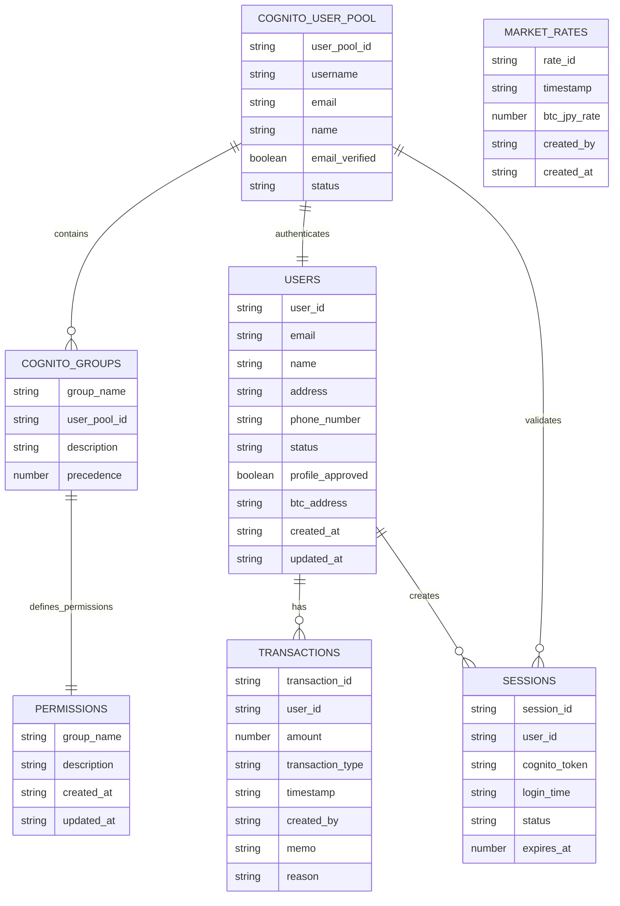
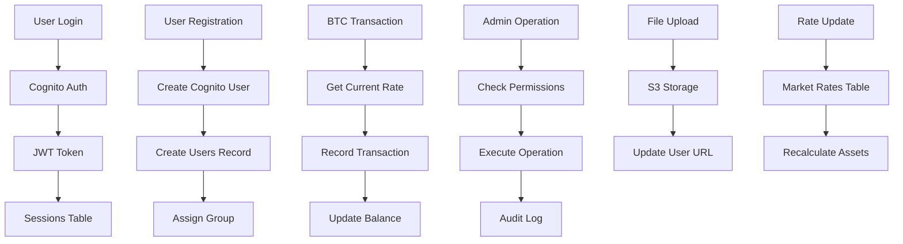

# M・S CFD App - ER図

## エンティティ関係図

DynamoDBを使用したNoSQLデータベースですが、アプリケーションレベルでのエンティティ間の論理的関係を以下に示します。

> **注意**: MermaidのER図では構文制約により、Primary Key（PK）、Sort Key（SK）、日本語コメント等を省略しています。詳細なフィールド情報は下記の「エンティティ詳細説明」セクションをご参照ください。



## データベース関係性の解説

### 🔗 直接的なリレーション

#### COGNITO_USER_POOL ↔ COGNITO_GROUPS（1対多）
- **外部キー**: `COGNITO_GROUPS.user_pool_id` → `COGNITO_USER_POOL.user_pool_id`
- **意味**: 1つのユーザープールは複数のグループを持つ
- **実装**: Cognitoサービス内での管理

#### COGNITO_GROUPS ↔ PERMISSIONS（1対1）
- **論理キー**: `COGNITO_GROUPS.group_name` = `PERMISSIONS.group_name`
- **意味**: Cognitoグループの詳細権限をDynamoDBで定義
- **例**: `"admin"` グループ → admin権限リスト、`"user"` グループ → user権限リスト
- **重要**: 物理的な外部キー制約はないが、論理的に強く結合

#### COGNITO_USER_POOL ↔ USERS（1対1）
- **関係**: Cognito認証とアプリケーションユーザーの対応
- **同期**: メールアドレスとuser_idで連携

#### USERS ↔ TRANSACTIONS（1対多）
- **外部キー**: `TRANSACTIONS.user_id` → `USERS.user_id`
- **意味**: ユーザーは複数の取引履歴を持つ
- **インデックス**: UserTimestampIndex で効率的にクエリ

#### USERS ↔ SESSIONS（1対多）
- **外部キー**: `SESSIONS.user_id` → `USERS.user_id` 
- **意味**: ユーザーは複数のログインセッションを持つ
- **特徴**: TTLによる自動期限切れ

### 🔄 間接的な参照関係

#### MARKET_RATES ↔ TRANSACTIONS（参照のみ）
- **外部キー**: なし
- **関係**: 取引時の相場価格を計算時に参照
- **実装**: アプリケーションレベルでの価格取得・計算

### ❌ 存在しない関係

#### USERS ↔ MARKET_RATES（関係なし）
**なぜ直接関係がないか：**

1. **MARKET_RATESの性質**
   - 全ユーザー共通の参照データ
   - 特定ユーザーに紐づかない独立したマスターデータ
   - 管理者が設定する全体設定

2. **created_byフィールドの誤解**
   - `created_by`は単なる監査ログ（誰が設定したかの記録）
   - 外部キー制約ではない
   - リレーションを表現するものではない

3. **データアクセスパターン**
   - ユーザーは相場価格を「参照」するのみ
   - 相場価格は「全ユーザー共通」で使用
   - 1対多の関係は存在しない

### 💡 実装例での関係性

#### MARKET_RATES使用方法（参照データ）

```typescript
// ❌ 間違った想定（直接リレーション）
// user.market_rates のようなプロパティは存在しない

// ✅ 正しい使用方法（参照データとして利用）

// 1. 全ユーザー共通の最新相場価格取得
const latestRate = await getLatestMarketRate()

// 2. ユーザーの資産価値計算時に相場価格を参照
const userBalance = await calculateUserBalance(userId)
const assetValue = userBalance * latestRate.btc_jpy_rate

// 3. 取引作成時に現在の相場価格を記録（参照のみ）
const currentRate = await getLatestMarketRate()
// 取引テーブルには相場価格は保存しない（別途計算で取得）
```

#### COGNITO_GROUPS ↔ PERMISSIONS関係の実装

```typescript
// ✅ 正しい権限チェックの流れ

// 1. Cognitoからユーザーのグループを取得
const userGroups = ['admin']  // Cognitoから取得

// 2. グループ名を使ってPERMISSIONSテーブルから詳細権限を取得
const permissions = []
for (const groupName of userGroups) {
  const groupPermissions = await dynamodb.get('permissions', { 
    group_name: groupName  // ← Cognitoグループ名をそのまま使用
  })
  permissions.push(...groupPermissions.permissions)
}

// 3. 権限チェック
const hasPermission = permissions.includes('user:create')

// ❌ 間違った実装
// COGNITO_GROUPSとPERMISSIONSの間に外部キー制約はない
// しかし、論理的には強く結合している
```

#### データ整合性の保証

```typescript
// Cognitoグループ作成時は、対応するPERMISSIONSレコードも作成する必要がある

// 1. Cognitoグループ作成
await cognito.createGroup({
  GroupName: 'new_role',
  UserPoolId: userPoolId
})

// 2. 対応するPERMISSIONSレコード作成（必須）
await dynamodb.put('permissions', {
  group_name: 'new_role',  // ← Cognitoグループ名と一致させる
  permissions: ['some:permission'],
  description: 'New role permissions'
})
```

## エンティティ詳細説明

### 主要エンティティ

#### 1. USERS（ユーザー）
- **役割**: アプリケーションユーザーの基本情報管理
- **特徴**: Cognitoユーザーと1対1で対応
- **Primary Key**: user_id
- **主要フィールド**: 
  - user_id: ユーザー一意識別子（パーティションキー）
  - email: メールアドレス（ユニークキー）
  - profile_approved: プロフィール承認状態
  - btc_address: Bitcoin アドレス
- **主要な関係**: 取引履歴、セッション、ファイルアップロードとの関連

#### 2. TRANSACTIONS（取引）
- **役割**: BTC入出金取引の履歴管理
- **特徴**: ユーザーごとの取引を時系列で管理
- **Primary Key**: transaction_id（パーティションキー）
- **Sort Key**: user_id（ソートキー）
- **主要フィールド**:
  - transaction_id: 取引一意識別子
  - amount: 取引金額（BTC）
  - transaction_type: deposit/withdrawal
  - timestamp: 取引実行日時
- **インデックス**: UserTimestampIndex (user_id + timestamp) での効率的検索

#### 3. MARKET_RATES（相場価格）
- **役割**: BTC/JPY相場価格の履歴管理
- **特徴**: 時系列での価格変動データ（全ユーザー共通の参照データ）
- **Primary Key**: rate_id（パーティションキー）
- **Sort Key**: timestamp（ソートキー）
- **主要フィールド**:
  - rate_id: レート識別子
  - btc_jpy_rate: BTC/JPY相場価格
  - created_by: 価格設定者ID（記録用、外部キーではない）
- **インデックス**: TimestampIndex (timestamp) での価格履歴検索
- **用途**: 取引時の価格参照、資産価値計算
- **重要**: USERSテーブルとは直接的なリレーションなし

#### 4. SESSIONS（セッション）
- **役割**: ユーザーのログインセッション管理
- **特徴**: TTL機能による自動削除
- **Primary Key**: session_id（パーティションキー）
- **主要フィールド**:
  - session_id: セッション一意識別子
  - user_id: ユーザーID
  - expires_at: セッション有効期限（TTL対象）
  - ip_address: IPアドレス
- **インデックス**: UserSessionIndex (user_id) でのセッション管理
- **セキュリティ**: IPアドレス、ユーザーエージェント記録

#### 5. PERMISSIONS（権限）
- **役割**: Cognitoグループの詳細権限定義
- **Primary Key**: group_name（パーティションキー）
- **特徴**: **Cognitoグループ名と完全一致**するPKを使用
- **主要フィールド**:
  - group_name: Cognitoグループ名（"admin"/"user"）
  - permissions: 権限リスト（DynamoDBではList型）
  - description: グループ説明
- **論理関係**: `COGNITO_GROUPS.group_name` = `PERMISSIONS.group_name`
- **Admin権限**: user:*, transaction:*, market_rate:*, profile:approve, admin:access
- **User権限**: profile:read, profile:update, transaction:read, dashboard:access
- **設計思想**: Cognitoの基本グループ機能 + DynamoDBでの詳細権限管理

### 外部システム

#### 1. COGNITO_USER_POOL（認証）
- **役割**: ユーザー認証・認可
- **機能**: パスワード管理、多要素認証、グループ管理
- **連携**: USERSテーブルとの同期

#### 2. S3_UPLOADS（ファイルストレージ）
- **役割**: プロフィール画像、ドキュメントの保存
- **セキュリティ**: プライベートアクセス、暗号化
- **関連**: USERSのprofile_image_url

## データフロー図



## インデックス設計

### Primary Keys
- **USERS**: user_id（パーティションキー）
- **TRANSACTIONS**: transaction_id（パーティションキー）+ user_id（ソートキー）
- **MARKET_RATES**: rate_id（パーティションキー）+ timestamp（ソートキー）
- **SESSIONS**: session_id（パーティションキー）
- **PERMISSIONS**: group_name（パーティションキー）

### Global Secondary Indexes (GSI)
- **UserTimestampIndex**: user_id + timestamp（取引履歴検索）
- **TimestampIndex**: timestamp（価格履歴検索）
- **UserSessionIndex**: user_id（セッション管理）

## セキュリティ・権限マトリックス

| 操作 | Admin | User | 未認証 |
|------|-------|------|--------|
| ユーザー作成 | ✓ | ✗ | ✗ |
| ユーザー情報閲覧 | ✓ | 自分のみ | ✗ |
| 取引作成 | ✓ | ✗ | ✗ |
| 取引履歴閲覧 | ✓ | 自分のみ | ✗ |
| 相場価格設定 | ✓ | ✗ | ✗ |
| 相場価格閲覧 | ✓ | ✓ | ✗ |
| プロフィール承認 | ✓ | ✗ | ✗ |
| ダッシュボードアクセス | ✓ | ✓ | ✗ |

---

**作成日**: 2024年1月28日
**バージョン**: 1.0
**作成者**: システム開発チーム